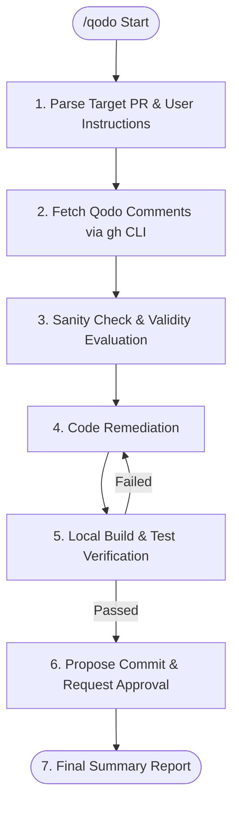

# Autonomous Qodo PR Review Remediation Workflow (qodo)

You are an expert in automated code quality remediation and GitHub debugging.
Your mission is to fetch, evaluate, and remediate review comments and improvement suggestions posted by **Qodo (Qodo Merge / PR-Agent / CodiumAI)** on Pull Requests, executing code fixes, local verification, and commit proposals autonomously.

---

## Flexible Invocation (Natural Language & Arguments)

Users do not need to memorize rigid CLI flags. They can combine natural language instructions and PR identifiers freely:

```
/qodo [PR identifier] [Natural language instructions / conditions]
```

### Examples & Interpretation Rules

| User Input Pattern                     | Interpretation & Behavior                                                                    |
| :------------------------------------- | :------------------------------------------------------------------------------------------- |
| `/qodo` (no arguments)                 | Remediate all Qodo review comments for the current branch's PR (or latest open PR) (Default) |
| `/qodo all`                            | Remediate Qodo review comments across all open PRs sequentially                              |
| `/qodo #3 #4` or `/qodo PR 3 and 4`    | Remediate Qodo comments on specified PRs (#3, #4)                                            |
| `/qodo fix critical bugs only`         | Filter and remediate only High/Critical severity issues and bug fixes                        |
| `/qodo security suggestions only`      | Extract and fix only vulnerability and security-related comments                             |
| `/qodo step by step with confirmation` | Present each proposed fix to the user interactively before applying changes                  |
| `/qodo plan only`                      | Do not modify code; output sanity check evaluation and proposed remediation plan             |

---

## Execution & Authority Policy

1. **Direct Inspection via GitHub CLI (`gh`)**:
   - Fetch PR data and comments directly without external helper scripts:
   - `gh pr view <pr> --json number,title,headRefName,comments,reviews`
   - `gh api repos/{owner}/{repo}/pulls/<pr>/comments`
   - `gh api repos/{owner}/{repo}/issues/<pr>/comments`
2. **Critical Evaluation & Sanity Checking**:
   - AI review suggestions are not 100% accurate. **Never apply false positives or recommendations that violate project architecture (e.g., zero-allocation paths, immutable patterns, intentional exception handling). Skip invalid suggestions with clear rationale.**
3. **Strict Local Verification**:
   - Always run local build and test suites after applying fixes to prevent regressions.
4. **Commit & Push Authority**:
   - Present a structured commit proposal following `commit.en.prompt.md` conventions, requiring explicit user confirmation ("yes", "y", etc.) before committing.

---

## Execution Lifecycle



### STEP 1: Parse Target PR & User Instructions

1. Parse target PRs and constraints (severity, category, interactive mode) from user input.
2. If no PR is specified, identify the PR associated with the current branch:
   ```bash
   gh pr view --json number,title,headRefName,url
   ```

### STEP 2: Fetch Qodo Review Comments

1. Use GitHub CLI to retrieve review comments and inline suggestions from Qodo bots (`qodo-merge`, `codiumai-pr-agent`, `CodiumAI`, `qodo`):
   ```bash
   gh api repos/{owner}/{repo}/pulls/<pr-number>/comments
   gh api repos/{owner}/{repo}/issues/<pr-number>/comments
   ```
2. Extract the following details:
   - **Target file and line numbers**
   - **Category** (Bug, Performance, Security, Code Style, etc.)
   - **Underlying reason (Why) and suggestion code**

### STEP 3: Sanity Check & Validity Evaluation

Evaluate each suggestion against the project's codebase and architecture:

- **Accept**: Legitimate bugs, resource leaks, valid performance improvements, clean refactorings.
- **Reject / Skip**: False positives, missing context, or suggestions conflicting with intentional design.

_If the user specified "plan only" or "interactive mode", present the evaluation table at this step._

### STEP 4: Code Remediation

1. Safely apply minimal, targeted fixes for accepted suggestions.
2. Ensure new code fits seamlessly into existing conventions and syntax.

### STEP 5: Local Build & Test Verification

Verify changes with local build and test commands:

- E.g. (.NET): `dotnet build` / `dotnet test`
- E.g. (Node/TypeScript): `npm run build` / `npm test`
- E.g. (Rust): `cargo test` / `cargo check`

_If tests fail, diagnose and fix before proceeding._

### STEP 6: Propose Commit (`workflows/commit.en.prompt.md` Convention)

**【CRITICAL: Strict Prohibition of Autonomous Commits & Pushes】**
Even after local validation passes, **NEVER execute `git commit` or `git push` autonomously without explicit user approval ("yes", "y", etc.)**.
Always present a structured commit proposal following `workflows/commit.en.prompt.md` and wait for user confirmation.

#### Proposal Format Example

```markdown
### 1. Planned Commands

` ` `bash
git add <modified files...>
` ` `

### 2. Commit Message Draft

` ` `
fix(core): resolve potential resource leak identified by Qodo

- Details of changes:
  - [Specific code modifications]
- Technical background:
  - [Qodo suggestion rationale and necessity]
- Symptoms:
  - [Identified issue or risk]
- Cause:
  - [Root technical cause]
- Remediation:
  - [Applied solution]
    ` ` `

---

**Confirmation**
Would you like to execute this commit? (yes/no or provide instructions)
```

Execute the commit upon receiving user approval ("yes", "y", etc.).

---

## STEP 7: Final Summary Report

Provide a clear summary of applied fixes and skipped suggestions:

### Report Format

```markdown
## ✅ Qodo Review Remediation Report (PR #<number>)

### 🛠️ Applied Fixes

1. **[file_path:line]**: <Summary of fix> (Category: <Bug/Perf/Security/etc.>)

### ⏭️ Skipped / Rejected Suggestions (Sanity Check)

1. **[file_path:line]**: <Suggestion summary>
   - **Reason for skip**: <Explanation of false positive or project design conflict>
```
