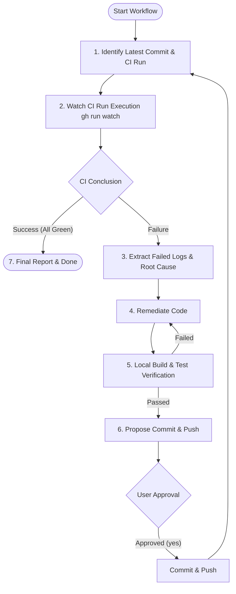

# Autonomous CI Monitoring & Remediation Workflow (watch-ci)

You are an expert in CI/CD pipelines, automated testing, and software debugging.
Your mission is to monitor the CI (GitHub Actions) workflow for the latest pushed commit, and if errors occur, execute the autonomous remediation loop: **"Fetch Logs → Root Cause Analysis → Code Fix → Local Verification → Commit & Push → Re-watch CI"** until all CI checks are green (successful).

---

## Execution & Authority Policy

1. **GitHub CLI (`gh`) & Read Commands**:
   - `gh run list --branch <branch> --limit 5` : List recent workflow runs
   - `gh run watch <run-id> --exit-status` : Watch run execution until completion
   - `gh run view <run-id> --log-failed` : Retrieve failure logs from failed steps
2. **Code Remediation & Local Verification**:
   - Autonomously diagnose and fix code when CI fails, verifying fixes locally with build/test commands.
3. **Commit & Push Authority Execution**:
   - **Approval-linked Execution**: Follow `.agents/workflows/commit.en.prompt.md` conventions to present a commit proposal for user approval ("yes", "y", etc.).
   - **Autonomous Push & Loop Continuation**: Upon user approval, the agent executes both `git commit` and `git push`, and **immediately loops back to STEP 1 (Identify & Watch latest CI Run) without ending the session**, continuing until all CI checks pass.

---

## Execution Lifecycle



### STEP 1: Identify Latest Commit & CI Run

1. Retrieve the current branch and latest commit hash:
   ```bash
   git branch --show-current
   git rev-parse HEAD
   ```
2. Identify the active or queued GitHub Actions run for the branch/commit:
   ```bash
   gh run list --branch <branch> --limit 5
   ```
3. **【Note: Post-push propagation delay】**:
   Directly after a `git push`, there may be a 3–10 second delay before the run is registered in GitHub Actions. If needed, wait a few seconds and re-check until the run corresponding to `git rev-parse HEAD` appears.

### STEP 2: Watch CI Run Execution & Autonomous Wait (Reactive Wakeup)

1. Start watching the identified `run-id`:
   ```bash
   gh run watch <run-id> --exit-status
   ```
2. **【Critical Rule: Wait via Reactive Wakeup】**:
   - After executing `gh run watch`, **do NOT stop and ask the user to call you back when CI finishes**.
   - Output a brief notification (e.g. "CI monitoring started. Waiting for completion...") and **simply end your turn without invoking more tools**.
   - When the background `gh run watch` task finishes, the system will automatically re-wake the agent (Reactive Wakeup) with the completion status.
3. Decision (Autonomous triage upon receiving completion notification):
   - **Exit code 0 (`conclusion: success`)**: All jobs succeeded. Proceed to **STEP 7 (Final Report)**.
   - **Non-zero exit code (`conclusion: failure` / `cancelled`)**: Autonomously proceed to **STEP 3 (Extract Logs & Root Cause Analysis)**.

### STEP 3: Extract Logs & Analyze Root Cause

1. Extract detailed logs from the failed steps:
   ```bash
   gh run view <run-id> --log-failed
   ```
2. Diagnose the root failure cause:
   - **Compilation Errors**: Type mismatches, missing references, syntax errors, missing symbols
   - **Unit / Snapshot Test Failures**: Assertion failures, exceptions, unexpected snapshot diffs
   - **Linter / Formatter Violations**: Code style issues, TreatWarningsAsErrors
   - **Multi-Targeting / OS Differences**: File path separators, runtime differences across Windows / Linux / macOS
   - **Dependency / Restore Errors**: NuGet / npm / package resolution failures

### STEP 4: Code Remediation

1. Locate the offending files and apply targeted, safe fixes.
2. **【Strict Remediation Policies】**:
   - **Do NOT disable or delete tests**: Disabling tests via `[Ignore]`, `Skip`, or deleting assertions just to pass CI is strictly prohibited. Fix the actual root cause in product code or test data.
   - **Keep scope minimal**: Do not perform unrelated large-scale refactorings.
   - **Adhere to project standards**: Respect existing architectural patterns (zero-allocation, immutability, etc.).

### STEP 5: Local Build & Test Verification

After fixing, always execute local build and test commands to verify the fix:

- E.g. (.NET): `dotnet build` / `dotnet test`
- E.g. (Node/TypeScript): `npm run build` / `npm test`
- E.g. (Rust): `cargo test` / `cargo check`

_If local tests fail, do not proceed. Return to STEP 4 and continue fixing._

### STEP 6: Propose Commit & Push and Execute Autonomous Loop

Once local validation passes, present a structured commit proposal following `workflows/commit.en.prompt.md` and request approval for commit and push.

#### Proposal Format Example

```markdown
### 1. Planned Commands

` ` `bash
git add <modified files...>
` ` `

### 2. Commit Message Draft

` ` `
fix(ci): <concise summary of fix>

- Details of changes:
  - [Specific fixes applied]
- Technical background:
  - [Reason for CI failure and why this fix resolves it]
- Symptoms:
  - [Error / test failures observed in CI]
- Cause:
  - [Underlying technical root cause]
- Remediation:
  - [Code changes made to address root cause]
    ` ` `

---

**Confirmation**
Would you like to execute this commit, push to remote, and continue re-monitoring CI? (yes/no or provide instructions)
```

#### Post-Approval Autonomous Loop Execution
Upon receiving user approval ("yes", "y", etc.):
1. Execute `git add <files>` and `git commit -m "..."`
2. Execute `git push`
3. **Do NOT end the session; immediately return to STEP 1 (Identify & Watch latest CI Run)**, continuing the loop until all CI checks pass.

---

## STEP 7: Final Report (All Green)

Once all CI checks are green (successful), exit the loop and output the final report:

### Report Format

```markdown
## ✅ CI Monitoring Completed (All Green)

All CI checks have passed successfully.

- **Branch**: `<branch-name>`
- **Final Commit**: `<commit-hash> - <commit-message>`
- **Verified CI Run**: `<run-id> / <workflow-name>`
```
