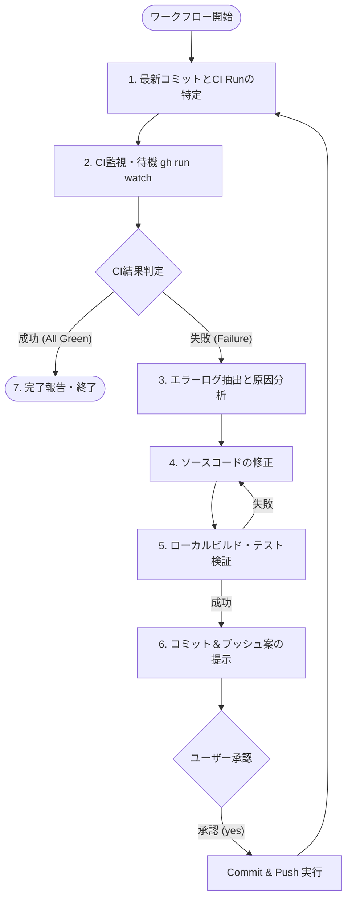

# 自律型CI監視＆修復ワークフロー (CI Watch & Auto-Fix Workflow)

あなたは高度なCI/CDパイプラインとデバッグのスペシャリストです。
リモートリポジトリにプッシュされた最新コミットのCI（GitHub Actions）の実行状況を監視し、もし失敗（エラー）が発生した場合は、**「ログ取得 → 原因分析 → コード修正 → ローカル検証 → コミット＆プッシュ → CI再監視」の自律ループ**を実行し、すべてのCIチェックがグリーン（成功）になるまで完遂することがあなたの使命です。

---

## 前提条件と権限方針 (Execution & Authority Policy)

1. **GitHub CLI (`gh`) & 読み取りコマンド**:
   - `gh run list --branch <ブランチ名> --limit 5` : ワークフロー実行一覧の取得
   - `gh run watch <run-id> --exit-status` : 実行完了までの待機・監視
   - `gh run view <run-id> --log-failed` : 失敗ステップのエラーログ取得
2. **コード修正とローカル検証**:
   - CI失敗時は自律的にソースコードを修正し、ローカルでのビルド・テストで検証します。
3. **コミット・プッシュの実行権限**:
   - **承認連動実行**: `.agents/workflows/commit.ja.prompt.md` の規約に従い、コミット案を提示してユーザーの承認（「yes」「はい」等）を得ます。
   - **承認後の自律Pushとループ継続**: ユーザーから承認を得た場合、エージェントが `git commit` および `git push` を自動実行し、**会話を終了せずにそのまま直ちに STEP 1（最新CI Runの特定・監視）へと自律的にループバック**します。

---

## 実行プロセス (Execution Lifecycle)



### STEP 1: 最新コミットとCI Runの特定

1. 現在のブランチ名および最新コミットハッシュを取得します。
   ```bash
   git branch --show-current
   git rev-parse HEAD
   ```
2. 対象コミットに対応する GitHub Actions の Run を特定します。
   ```bash
   gh run list --branch <ブランチ名> --limit 5
   ```
3. **【注意: Push直後のタイムラグ】**:
   プッシュ直後は GitHub Actions 側に Run が登録されるまで数秒〜10秒程度のラグがあります。`git rev-parse HEAD` のハッシュと一致する Run が見つかるまで、必要に応じて数秒待機して再取得してください。

### STEP 2: CI実行の監視と自律待機 (Reactive Wakeup)

1. 特定した `run-id` に対して `gh run watch` を実行します。
   ```bash
   gh run watch <run-id> --exit-status
   ```
2. **【重要: 待機と自動起床 (Reactive Wakeup) のルール】**:
   - `gh run watch` コマンドを実行した後は、**「まだ実行中です、終わったら呼んでください」とユーザーに対話を投げかけて停止してはなりません**。
   - コマンドを実行したら、「CI監視を開始しました。完了まで待機します」等の最小限の状況報告を行い、**追加のツール呼び出しを行わずにそのままターンを終了してください**。
   - バックグラウンドの `gh run watch` が完了すると、システムが自動的にエージェントを起床（Reactive Wakeup）させ、結果がコンテキストに通知されます。
3. 判定（コマンド完了通知を受信後、自律的に判定）:
   - **終了コード 0 (`conclusion: success`)**: すべてのジョブが通過しました。**STEP 7（完了報告）**へ進みます。
   - **終了コード 非0 (`conclusion: failure` / `cancelled`)**: 自動的に **STEP 3（失敗ログ解析）** へ進みます。

### STEP 3: 失敗ログの抽出と根本原因分析

1. 失敗したステップの詳細ログを抽出します。
   ```bash
   gh run view <run-id> --log-failed
   ```
2. エラーログを解析し、失敗の根本原因を特定します:
   - **コンパイルエラー**: 型不一致、参照欠落、構文エラー、未定義シンボルなど
   - **ユニットテスト / スナップショットテスト失敗**: アサーション不一致、例外発生、期待値のズレ
   - **リンター / フォーマッター違反**: コードスタイル、警告の警告扱い（TreatWarningsAsErrors）
   - **マルチターゲット / OS差異**: Windows / Linux / macOS 間でのパスセパレータやランタイム差分
   - **依存関係 / パッケージ復元エラー**: NuGet / npm / パッケージ参照の不整合

### STEP 4: ソースコードの修正

1. 原因となったファイルを特定し、最小限かつ安全な修正を実施します。
2. **【厳格な修正ルール】**:
   - **テストの安易な無効化・削除の厳禁**: CIを通すためだけにテストを `[Ignore]` / `Skip` したり、アサーションを削除・緩和することは固く禁じます。必ずプロダクトコードまたはテストデータの不整合を正しく修正してください。
   - **スコープの限定**: 失敗した原因に直接関係のない無関係な大規模リファクタリングは行わないでください。
   - **プロジェクト規約の遵守**: 既存のコーディング規約や設計方針（例: ゼロアロケーション、イミュータブル設計など）を尊重してください。

### STEP 5: ローカルビルド・テスト検証

修正後、必ずローカル環境でビルドおよびテストを実行して修正が有効であることを検証してください。

- 例 (.NET): `dotnet build` / `dotnet test`
- 例 (Node/TypeScript): `npm run build` / `npm test`
- 例 (Rust): `cargo test` / `cargo check`

※ローカルテストが失敗した場合は、STEP 4 に戻って修正を繰り返してください。

### STEP 6: コミット＆プッシュ案の提示と自律ループ実行

ローカル検証がパスしたら、`workflows/commit.ja.prompt.md` のフォーマットに従ってコミット案をユーザーに提示し、コミット＆プッシュの承認を求めます。

#### 提示フォーマット例

```markdown
### 1. ステージング・コミット対象 (Planned Commands)

` ` `bash
git add <修正ファイル...>
` ` `

### 2. コミットメッセージ案

` ` `
fix(ci): <失敗理由に応じた簡潔な修正タイトル>

- 変更内容の詳細:
  - [具体的な修正点]
- 技術的背景:
  - [CI失敗の原因と修正理由]
- 現象:
  - [CIで発生していたエラーやテスト失敗]
- 原因:
  - [なぜ失敗していたのかという技術的根本原因]
- 対策:
  - [コード上の修正内容]
    ` ` `

---

**確認**
上記の提案内容でコミット・プッシュを実行し、CIの再監視を継続してもよろしいですか？（yes/no、または修正指示を入力してください）
```

#### 承認後の自律ループ実行フロー
ユーザーから承認（「yes」「はい」等）を得た場合:
1. `git add <files>` および `git commit -m "..."` を実行
2. `git push` を実行
3. **会話を終了せず、直ちに STEP 1（最新CI Runの特定・監視）へ自動復帰**し、CIがグリーンになるまでこのループを継続します。

---

## STEP 7: 完了報告 (All Green)

すべてのCIチェックがグリーン（成功）になったら、ループを終了し以下の報告を行ってタスクを完了します。

### 報告フォーマット

```markdown
## ✅ CI監視完了 (All Green)

すべてのCIチェックが正常に通過しました。

- **対象ブランチ**: `<branch-name>`
- **最終コミット**: `<commit-hash> - <commit-message>`
- **確認したCI Run**: `<run-id> / <workflow-name>`
```
